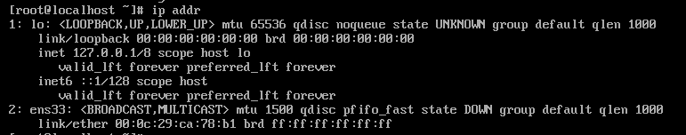
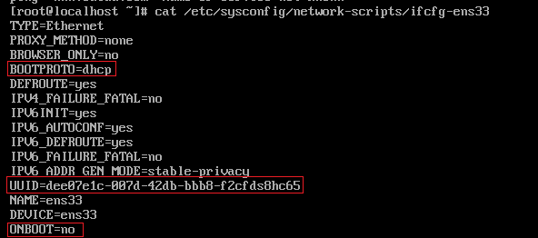
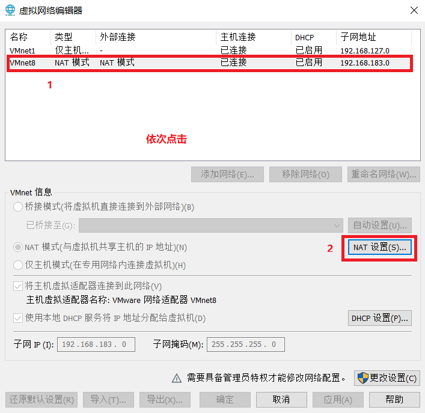
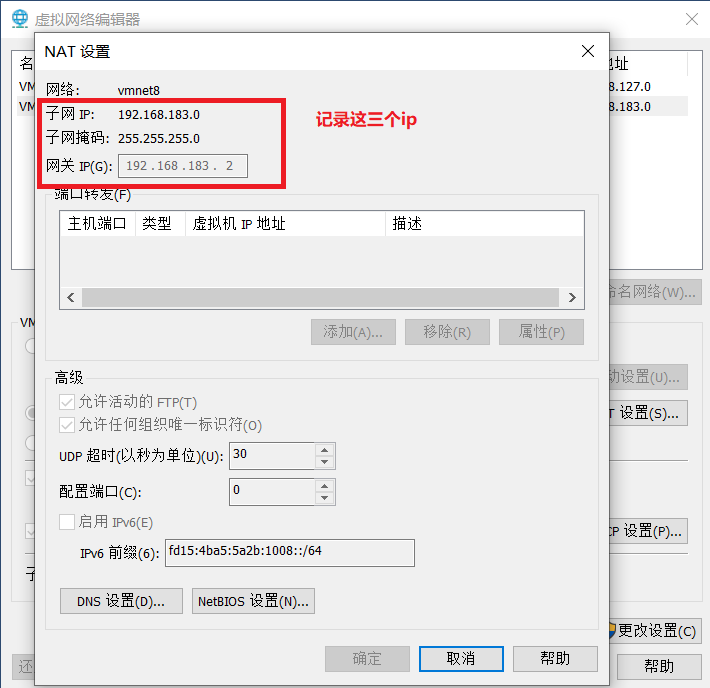
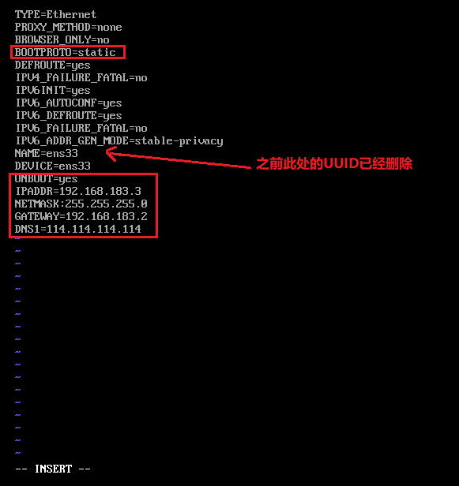
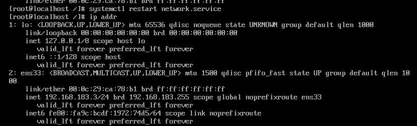

# 为 centOS 7 配置静态（static）网络
---
1. 使用指令 <pre>ip addr</pre>查看网络情况   可知ens33没用配置ip
2. 使用指令<pre>cat /etc/sysconfig/network-scripts/ifcfg-ens33</pre>查看网络配置  红色框标记的地方是需要修改的，稍后再修改。
3. 打开VM软件，点击 编辑->虚拟网络编辑器 弹出弹窗。  依次点击1，2出现弹窗2，记录弹窗中红色框的内容，待会配置网络需要使用。  
4. 使用指令<pre>vi /etc/sysconfig/network-scripts/ifcfg-ens33</pre> 在vim编辑器中编辑ifcgf-ens33文件。进入vim编辑器中使用键盘的上下左右键控制鼠标光标，键入i之后可修改内容，如图左下方显示INSERT字样。修改完毕后，首先键入ESC,然后输入:wq即可保存文件以及退出vim编辑器，更多vim指令请上网搜索。   
5. 使用指令<pre>systemctl restart network.service</pre>重启网络驱动。 使用指令<pre>ip addr</pre>查看ens33配置信息，可以看到刚刚配置的ip信息 
6. 使用指令<pre>ping www.baidu.com</pre>可以连接到该链接。 
7. 经过以上步骤后你的linux就可以链接网络啦。
---
