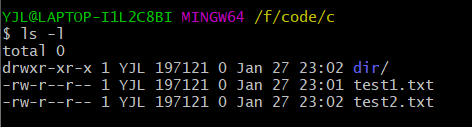
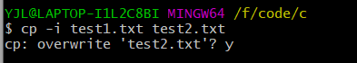
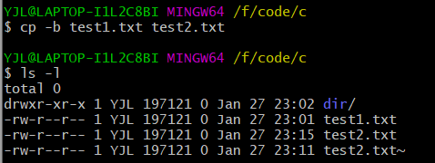
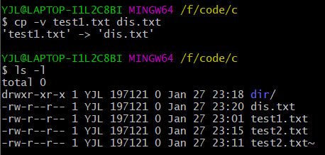
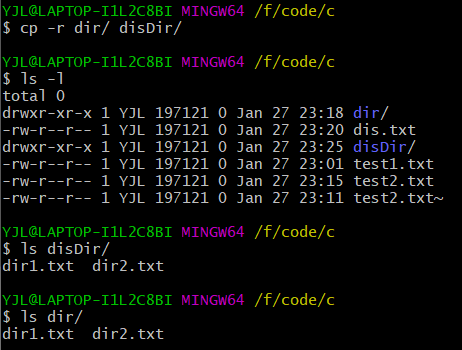
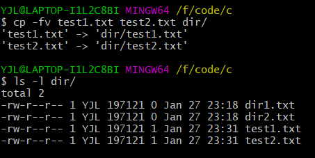
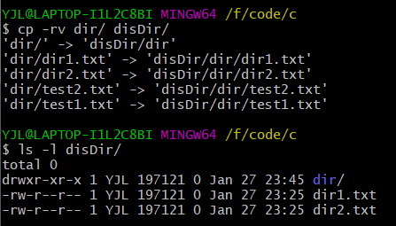

# linux cp指令总结（2022.1.27）
---
## 一、指令说明
cp为单词copy的缩写，其功能是复制文件或者目录。

## 二、语法格式
<pre>cp [参数] [源列表] [目标]</pre>

## 三、常用参数
| 参数 | 助记单词 | 说明 |
|----|----|----|
| -f | force | 若目标文件已经存在则会直接覆盖目标文件|
| -i | | 与-f相反，在复制过程中若目标文件已经存在则会询问是否覆盖文件，输入y覆盖|
| -b | backup | 若目标文件以及存在，则将目标文件备份后在进行覆盖复制 |
| -l | hard-link | 对源文件进行硬链接，而不是进行复制 |
| -s | soft-link | 对源文件进行软链接，而不是进行复制 |
| -v | | 详细显示复制过程 |
| -d | | 复制时保留链接,这里所说的链接为软连接 |
| -p | | 除复制文件的内容外，还把修改时间和访问权限也复制到新文件中 |
| -r/-R | recursion | 若源文件是目录则会递归复制该目录下的子目录以及文件 |
| -a | -dpR组合 | 此选项通常在复制目录时使用，它保留链接、文件属性，并复制目录下的所有内容。|

## 三、单参数实例
1. 首先查看当前目录下的所以文件 
2. 目标文件已存在，使用指令<pre>cp -f test1.txt test2.txt</pre>进行强制复制，不会出现任何提示信息  
3. 目标文件已存在，使用指令<pre>cp -i test1.txt test2.txt</pre>进行复制会出现是否覆盖的提示信息，输入y覆盖目标文件，n退出复制。  
4. 目标文件已存在，使用指令<pre>cp -b test1.txt test2.txt</pre>进行复制，首先备份目标文件（备份文件后有~）再进行复制。  
5. 详细显示复制过程<pre>cp -v test1.txt dis.txt</pre>  
6. 递归复制该目录全部文件到目标目录中：1、若目标目录不存在则创建目标目录并把源目录下的全部文件复制到刚刚创建的目标目录下；2、若目标目录已存在，则将源目录复制到目标目录下。<pre>cp -r dir/ disDir/</pre>  

## 四、多参数实例
1. 将多个文件强制复制到一个目录中并显示过程<pre>cp -fv test1.txt test2.txx dir/</pre>  
2. 将一个目录复制到另一个目录并显示过程<pre>cp -rv  dir/ disDir/</pre>  
3. 更多cp指令请自己动手实践
---