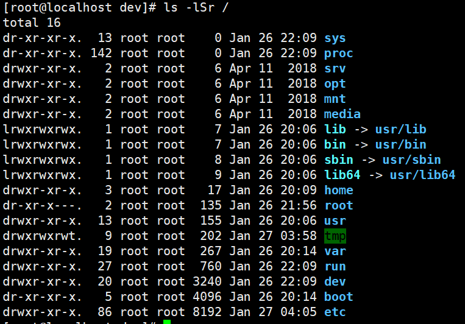

# linux ls指令总结（2022.1.26）
---
## 一、指令说明
ls指令是单词list的缩写，其含义为列举的意思，若不指定目录则默认为当前所在目录，功能为列出指定目录下的内容及其属性信息。

## 二、语法格式
<pre>ls [参数] [文件]</pre>

## 三、常用的参数
| 参数 | 助记单词 | 说明 |
|----|----|----|
| -a | all | 显示所有文件及目录 (包括以“.”开头的隐藏文件) |
| -l | long | 使用长格式列出文件和目录信息 |
| -r | reverse | 将文件以相反次序显示 |
| -t | time | 根据最后修改时间排序显示 |
| -A | All | 显示所有文件及目录 |
| -S | Size | 根据文件大小排序 |
| -R | recursion |递归列出所以子目录 |

## 四、ls指令实例
### 1、单个参数使用
1. 显示根目录全部文件包括隐藏文件以及 . 文件和 .. 文件。<pre>ls -a</pre> 
2. 使用长格式显示根目录下的文件，默认根据字符排序。显示列含义依次是 “权限--硬链接个数--文件属主--文件属组--文件大小--最后修改时间--文件名”<pre>ls -l</pre> 
3. 反序显示根目录下的文件。<pre>ls -r</pre> 
4. 根据最后修改时间显示根目录下的文件。<pre>ls -t</pre> 
5. 显示根目录下全部文件，不包括. 文件和 .. 文件。<pre>ls -A</pre> 
6. 根据文件大小显示根目录下的文件。<pre>ls -S</pre> 
7. 递归显示dev目录下的所以文件以及目录。<pre>ls -R</pre> 

### 2、多个参数使用
1. 使用长格式并且根据文件大小排序在以相反次序显示根目录下的文件<pre>ls -lSr /</pre> 
2. 显示全部文件包括隐藏文件以及 . 文件和 ..文件然后根据长格式显示然后所以文件根据修改时间排序，简短来说/usr/目录下的所以文件根据时间排序并以长格式显示。<pre>ls -alt /</pre> 
3. 其他组合形式大家都可以试一试。
---