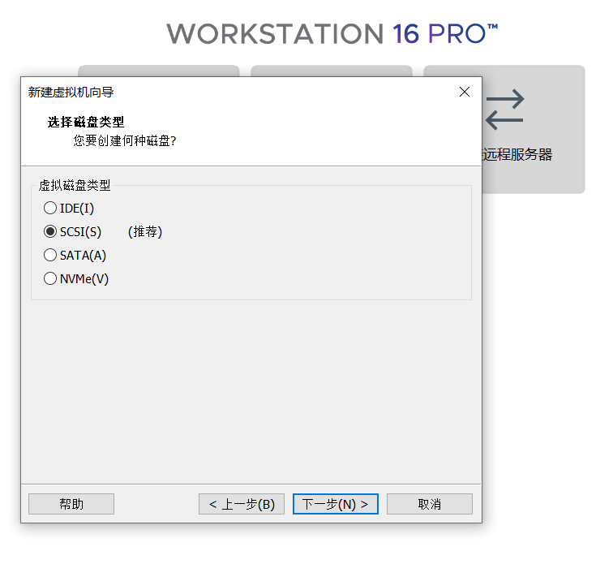

# 在虚拟机上安装centOS系统
---
## 一、下载centOS镜像
[centOS镜像网址]:https://www.centos.org/ "镜像网址"

1. 点击[centOS镜像网址]下载对应的centOS镜像
2. 点击红色→指向的区域 
3. 此次下载centOS-7版本 
4. 点击第一个链接 
5. 点击下载
---
## 二、新建VM虚拟机
1. 打开VM，然后点击 “文件->新建虚拟机” 或者点击主页上的 “创建新的虚拟机” 
2. 在选项卡中选择"自定义(高级)" 
3. 选择默认兼容性，点击下一步 
4. 选择稍后安装操作系统 
5. 操作系统选择linux
6. 版本选择你之前下载的镜像版本
7. 命名虚拟机以及选择虚拟机的安装位置 
8. 为虚拟机配置处理器，根据自己电脑的配置选择 
9. 其中处理器内核总数不能超过自己主机的逻辑处理器总数
10. 为虚拟机配置运行内存，不能超过自己主机的最大运行内存 
12. 为虚拟机配置网络类型，默认选项 
13. 默认选项 
14. 默认选项 
15. 默认选项 
16. 为虚拟机配置磁盘大小 
17. 选择虚拟机磁盘安装位置 、
18. 点击完成即可 

## 三、在VM中安装linux
1. 由于之前选择了稍后安装操作系统，所以现在需要选择相应的镜像文件
2. 点击编辑虚拟机设置
3. 然后点击使用ISO镜像文件 
4. 浏览选择相应的iso镜像文件即可

## 四、linux安装步骤
1. 键盘选择第一个install centOS 7 
2. 回车 
3. 选择语言
4. 基础设置，选择软件选择安装桌面版本 
5. 设置root以及用户 
6. 重启虚拟机 